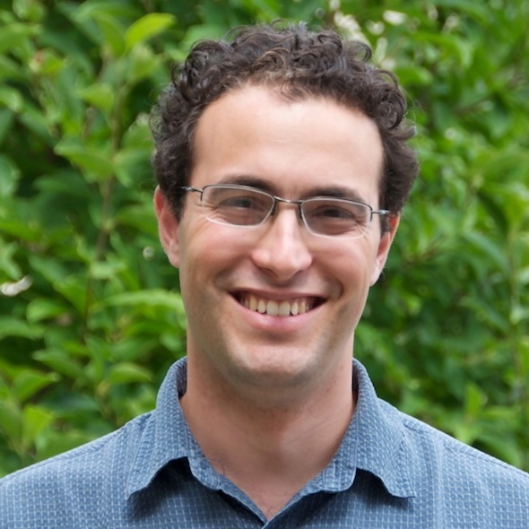

{.image-fluid .rounded .pull-left alt="Joshua A. Shapiro" width="120"} I am a biologist.
These days mostly computational, but I used to do wet lab work as well.
I've done plenty of PCR and sequencing (Sanger, Illumina, and Nanopore, even).
I've spent time pushing flies and dissecting yeast tetrads.
I've even done a bit of field work.
But now I mostly sit in front of a computer, for better or worse.

Some links to my profiles on other sites:

-   [ORCID](https://orcid.org/0000-0002-6224-0347)
-   [Google Scholar](http://scholar.google.com/citations?user=MOeyMcoAAAAJ)
-   [Bluesky](https://bsky.app/profile/josh.shapiro.foo)
-   [Mastodon](https://genomic.social/@jashapiro)
-   [LinkedIn](https://www.linkedin.com/in/jashapiro/)

In other parts of my life, I enjoy kayaking (whitewater especially) and canoeing and try to get out into nature as much as I can.
Lately, that has been with the [Philadelphia Canoe Club](https://philacanoe.org), but it all started at [Keewaydin](https://keewaydin.org).
