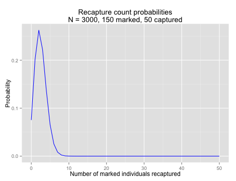

[back to Calculations & Simulations](capture_recapture2.html)

## Capturing Lizards
Now that the class has agreed on the sampling scheme, it is time to do it! Each of you will come up and "catch" some lizards, marking each with a stripe on its tail. If we were doing a real experiment, we would be remiss not to take some measurements of the lizards. Measurements on toy lizards are a bit silly, but do record how many of each color you capture. After all of the lizards are marked, we will throw them back in the box and mix thoroughly. Then you can catch the second sample, again recording how many of each color were caught, and how many were marked with tail stripes (by color and total). *Do not return these lizards to the box.* We will keep them for later experiments.

{: .problem-nonum}
Estimate the following quantities from the pooled class data:  
**a.** The total number of lizards in the box.  
**b.** The number of lizards of each color in the box.  
**c.** The proportion of lizards that are each color.   
**d.** There are at least two ways to do the second two calculations. Which do you think is more accurate? If you are motivated, design and perform some simulations to test your intuition.

 

## Estimating Error
Now that we have an initial estimate of the lizard population, we need to think about how confident we are in that estimate, and ways we might improve our estimate.

You calculated the true error for your simulation runs last time when you looked at the mean squared error. Of course, you don't know the true population size most of the time, and we don't know it for the box of lizards, so this is not something that is possible to calculate for most real data. Instead you have to calculate some form of confidence interval or credible interval. There are two a few ways to do this: using the standard error, a likelihood model, and with Bayesian statistics.

### Standard Error
It is possible to calculate the standard deviation of the estimate of population size using frequentist statistics. We won't derive this equation, but it is a reasonable place to start:
$$\mathrm{SE}(N) = \sqrt{\frac{(M+1)(C+1)(M-R)(C-R)}{(R+1)(R+1)(R+2)}}$$

Using the standard approximation of the 95% confidence interval as $\hat{N} \pm 1.96 \cdot \mathrm{SE}(N)$ it is possible calculate the confidence intervals for the previous simulations.

{: .problem-nonum}
Write a function to calculate the standard error and 95% confidence intervals from a capture-recapture experiment using the numbers of individuals captured in the first and second trappings and number of marked (recaptured) individuals in the second trapping.  
**a.**  Calculate the standard error and a 95% confidence interval for your estimate of the number of lizards in the box.  
**b.**  Calculate the standard errors and confidence intervals for your previous simulations. Generate histograms of the minimum and maximum for each confidence intervals from the the of simulations where you captured 100 individuals the first time.  
**c.**  Do these confidence intervals make sense? Why or why not?  
**d.**  What fraction of the time does your confidence interval include the true size of the population? Does this agree with what you know about confidence intervals?  

### Likelihood Analysis

The likelihood is the probability of the data we observed given some set of particular parameter values. In this situation, it is the probability that we would capture $R$ marked lizards in our second trapping, given a certain population size $N$: $\Pr(R\mid N)$. As I mentioned earlier, in this case that probability is given by the hypergeometric distribution:
$$\Pr(R \mid N=x) = \frac{\binom{M}{R}\binom{N-M}{C-R}}{\binom{N}{C}}$$
We can calculate this probability using the `dhyper()` function. This takes the same `m`, `n`, and `k` arguments as `rhyper()`, but returns the value of the hypergeometric probability distribution at some value `x`. (The `d` here stands for "density", as what we are looking for is the value of the probability density function. For a discrete distribution like the hypergeometric, this is the same as a probability, but for continuous distributions it is somewhat different.)

So if we want to know the probability of catching 5 marked lizards among 50 lizards  in our second round of trapping, assuming the population size was 3000 and we marked 150 individuals on the first trapping, that would look like this:


dhyper(x = 5, m = 150, n = 3000 - 150, k = 50)



## [1] 0.06545


In fact, we could calculate it for a range of numbers of marked individuals, using the fact that `R` loves to work with vectors. We could go ahead and calculate the entire probability  distribution; the chance of catching 0, 1, 2, ... , 50 marked individuals in a sample of 50, which I have plotted for your edification. What you may not be able to see exactly, but should be aware of, is that the sum of these probabilities is equal to 1. Check this for yourself using `sum()`.


#full probability distribution
recaptured <- 0:50
probs <- dhyper(recaptured, m = 150, n = 3000 - 150, k = 50)

library(ggplot2) #load ggplot2
qplot(x = recaptured, y = probs,
      color = I("blue"), 
      geom = "line",
      main = "Recapture count probabilities\nN = 3000, 150 marked, 50 captured",
      xlab = "Number of marked individuals recaptured", 
      ylab = "Probability")


 

Of course, for a given experiment, we only see one outcome; we capture one group of animals and see one number of marked individuals among them. What we want to know is what the chance is that we would have seen that number of marked individuals given some range of population sizes. Again, this is the *likelihood* of the data given a particular parameter value. `R` is happy enough to calculate `dhyper()` for a variety of population sizes as well, and we can generate a plot of the likelihood of observing 5 marked individuals given a variety of total population sizes. 


popsize <- 200:5000
likes <- dhyper(5, m = 150, n = popsize - 150, k = 50)
qplot(x = popsize, y =  likes,
      color = I("blue"), 
      geom = "line",
      main = "Population size likelihoods\n150 initially marked; 5 of 50 recaught",
      xlab = "Population Size", 
      ylab = "Likelihood")


 

The likelihood of the data across a range of parameters is often used directly to estimate the true value of a paprameter. To do this, you find the *maximum likelihood*, the value of the parameter that results in the largest likelihood value under your model.  

{: .problem-nonum}
Calculate the likelihood values for lizard population sizes between 200 and 100,000 individuals, using the capture-recapture data from class. Generate a plot of the population sizes and the corresponding likelihoods.  
**a.**  What is the maximum likelihood, and what population size does it correspond to? You will find the functions `max()` and  `which.max()`, which is also discussed on the next page, to be quite helpful.  
**b.**  How does the maximum likelihood value you calculate compare to a naive estimate of the population size ($N = \frac{MC}{R}$). What about the Schnabel estimate?  
**c.**  Do the values of the likelihood distribution sum to 1? Why or why not? (An intuitive explanation is fine.)  
**d.**  A common way of estimating a confidence interval on a maximum likelihood calculation is to find the range of values such that  $\log({\rm Max}({\rm Likelihood}(\theta))/{\rm Likelihood}(\theta = x)) \le 1.92$. Based on this method, what confidence interval would you calculate for the population size? Does this method seem better or worse than the standard error-based calculation presented earlier? Why?  

## Next
[Reverend Bayes and the Lizard Posterior](capture_recapture4.html)
