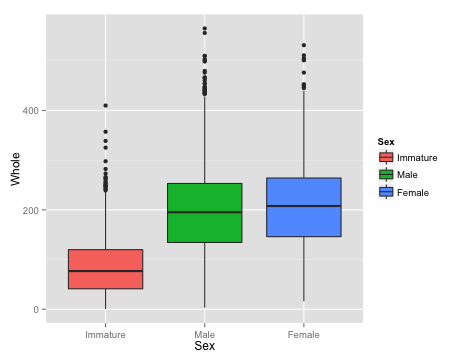
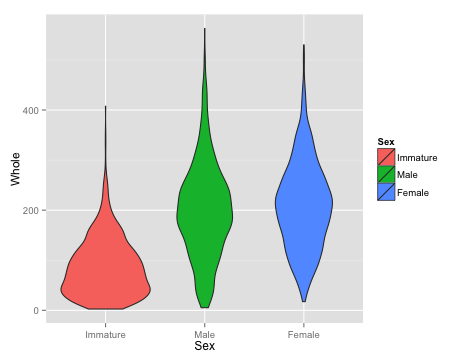
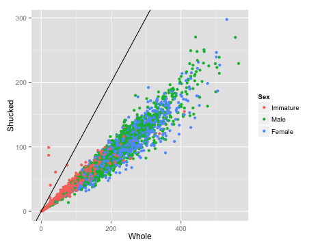

Regression, or more generally, linear modeling, is one of the more common statistical techniques in common use. Any time you have two or more numerical variables (and in many cases with categorical variables as well), linear modeling can be extremely useful to identify and quantify the relationships among those variables. In this exercise, we will learn how to construct linear models in `R`. We will also explore the ways that resampling can be used to generate confidence intervals for estimates of parameters, even if the exact formula for the confidence interval is not known, or the observed distribution does not fit the assumptions of a particular model (such as normality). But before we get to that, we have to look at the data, and possibly clean it up a bit.

## Getting the Data

The data we will use for this lab is measurements of blacklip abalone collected from the Bass Strait, which separates Tasmania from mainland Australia. These data were originally published as part of the the following study:

WJ Nash, TL Sellers, SR Talbot, AJ Cawthorn and WB Ford (1994).
The Population Biology of Abalone (*Haliotis* species) in Tasmania. I. Blacklip Abalone (*H. rubra*) from the North Coast and Islands of Bass Strait. 
Sea Fisheries Division, Technical Report No. 48 (ISSN 1034-3288) 

You can find the data in CSV format at the following link: [abalone.csv](abalone.csv). Download the file and put it in your working directory. (You did make a new project with its own folder for all of your work on this exercise, right?)  CSV stands for "comma separated values" and is one of the more convenient formats for getting data into `R`. It has the advantages of being a plain text format, so it is easy to read and write from a variety of software, and the format is(fairly) standard, meaning that most programs will write and read data from it in the same way[^excel]. Each row of text is a row of the table, with the columns separated by commas (hence: "comma separated"). The first row contains column headings, and the remaining rows contain data. That's it. Unlike an Excel file, it doesn't include any fancy formatting or equations to calculate values, but this is actually a good thing. We want to separate the data from the calculations that we do on it as much as possible.

[^excel]: To save a CSV file from Excel or most other spreadsheet programs, use the "Save As..." command and select "Comma Separated Values (.csv)" from the format options. Excel will complain that there are features of Excel that won't work with that format. Tell it to continue.

To read the file, we will use the `read.csv()` command[^readtable], and store it in a variable called `abalone`. While we are at it, we'll also load up `plyr`, as it will come in handy later.

[^readtable]: The `read.csv()` function is one of many functions in R that are part of the `read.table()` group. All of them read in simple text file tables with individual fields separated in various ways (tabs, spaces, commas, you name it). The base function `read.table()` is quite customizable; you can explore the various options available by looking at the help page in `R`. One particular note is that `R` will read text strings in as factors unless you tell it not to with the argument `stringsAsFactors = FALSE`. For these data, we wanted to leave male and female as factors, but if you have a column of things like sample names or DNA sequences, you might not want to do that. You can always convert a column from text to a factor later, as needed.


library(plyr)
abalone <- read.csv("abalone.csv")


Look at the data. The column names are fairly informative in general, but some are not, so I have defined them below:

Variable | Unit | Description
-------- | :----: | -----------
`Sex` | | `M` (male), `F` (female), or `I` (immature)
`Length` | mm | longest shell measurement 
`Diam` | mm	 | shell measurement perpendicular to length 
`Height` | mm | height of abalone (including body) 
`Whole` | g| weight of whole abalone 
`Shucked` | g | weight of meat 
`Viscera` | g| gut weight
`Shell` | g | shell weight after drying 
`Rings` | | number of rings in the shell 

The abalone add one ring to their shell every year, except in their first year, and we can estimate the age of the abalone quite accurately by adding 1.5 to the number of rings. 

Make a new column called `Age` in the `abalone` data frame using this fact.
{: .question}

## Data summaries
This is a big data set, so it is hard to get a sense of how it looks just by scanning it. It is always a good idea to make some preliminary graphs, just to get a sense of the data. 

Start by loading the `ggplot2` library and making a histogram of the abalone weights using `qplot()`. 


library(ggplot2)
qplot(Whole, 
      data = abalone, 
      geom = "histogram")



## stat_bin: binwidth defaulted to range/30. Use 'binwidth = x' to adjust
## this.


 

Isn't that pretty? Sure, but it might not really be what we are interested in looking at, as it is a combination of all sexes. We might want to see if the different sexes had different distributions. So we would like to make separate plots for each sex. This is quite easy to do in `ggplot2`, with the `facets` argument, which takes an R formula, like the one we used for ANOVAs (and will shortly use for regressions). The left side of the tilde (`~`) tells what variable you want to separate the data by for vertically arranged panels and the right side tells what variable to separate by for horizonal panels. You can do both, but if you only want to do one, you use a period for the other axis, as shown below. (I also added in a `binwidth` argument, so `ggplot` will stop complaining... )


library(ggplot2)
qplot(Whole, 
      data = abalone, 
      geom = "histogram", 
      facets = Sex~., 
      binwidth = 20)


 

You will note that the labels for each panel are shown on the right side, and the ordering is by alphabetical order. We probably don't care too much, but it might be nice to make the @Sex@ column into an ordered factor, and we might as well make the labels nicer while we are at it. I do this below in one step, but it is worth checking that everything is correct before you replace the data in the data frame, lest you unwittingly create random errors.


#make Sex and ordered factor
abalone$Sex <- ordered(abalone$Sex, 
                       levels = c("I", "M", "F"), 
                       labels = c("Immature", "Male", "Female"))
#redo the histogram


We can also use `qplot()` to make boxplots, which may be a bit nicer for this application, as it is easier to see some of the critical points in the data than it was with the histograms. We do this by putting the weight on the Y axis, and separating by sex on the x axis. Change the `geom` to boxplot and there you have it. I also added in a bit of color with the `fill` argument, which is a bit redundant here, but why not. Notice how `qplot()` automatically turned the factor column into a reasonable color scheme.


qplot(Sex, Whole, 
      data = abalone, 
      geom = "boxplot", 
      fill = Sex)


 

While we are playing around, one more plot... An alternative to the box plot that you occasionally see is the violin plot, which is sot of like a histogram thrown on its side. It is not quite as useful for quantification, but it can look pretty nifty and display aspects of the data that are not immediately obvious from the boxplots.


qplot(Sex, Whole, 
      data = abalone, 
      geom = "violin", 
      fill = Sex)


 

Look at all of the continuous variables using your preferred visualization method. You do not need to turn in all of these plots, but use them to answer the questions below.  
**a.** Describe the shape of the distributions for each variable. Do they appear normal overall (with the sexes combined)? Does separating by Sex make them appear normal?  
**b.** Are there any values that look particularly strange? What do you think caused those?  
**c.** Show me your favorite of the plots you generated. Make sure it is well labeled.
{: .question}

**Before proceeding, remove any rows from the data frame with obviously bad data.** This should include any rows where a measurement is equal to 0.  

One question you might have wanted to address right away is whether there are significant differences between the sexes. It should not be surprising that the immature abalone are smaller (and younger), so we can ignore them for now. While the book might suggest a planned comparison test here to improve power, the variances among groups seem to vary (do you agree?), so we will stick with the *t*-test, or the Mann-Whitney *U*, whichever is appropriate for these data. You find it convenient to take a subset of the original data frame with only the adults. You might also find the `ddply()` and `summarize()` functions that we used last time helpful, though you can do without them if you are willing to type more...

Are there significant differences between Males and Females for any of these traits? Report your results in a table that includes descriptive statistics for each group, as well as the test statistics and *P* values for whichever tests you decide to perform.  
{: .question}

## Scatter Plots

With a general picture of the data, and having removed some of the problematic data points, we can start to look at how the measurements of the abalone relate to each other. But again, before getting to calculating the statistics, it is worth having a look at the data. We will focus on the length, height, whole weight, shucked weight, shell weight, and age of the abalone.

Scatter plots in `ggplot` are just as easy as with standard plotting, and possibly easier. As an example, here is a plot of the whole weight vs shucked weight, colored by sex. Notice how `ggplot` adds a nice legend, something that is really annoying to do in base `R`. 


qplot(Whole, Shucked, 
      data = abalone, 
      color = Sex)


 

### More cleaning
That looks pretty nice, but do you notice anything strange about the data in the plot? Shucked weight is supposed to be the weight without the shell, so it seems more than a bit odd that there are some abalone that are heavier after removing the shell. Just to look at it a bit more clearly, I'll add a line to the plot. Recall that to add to a plot with `ggplot`, we literally add, with a `+`, to the plot command. In this case we will use`geom_abline`, which works like the `abline` in base R, to add a line with a slope of 1 and an intercept of 0 (the default).


qplot(Whole, Shucked, 
      data = abalone, 
      color = Sex) +
  geom_abline(slope = 1)


 

The points above the line are almost certainly errors, and they could cause problems later on when we are fitting regression equations. Since we don't know if the whole weight or the shucked weight is correct, we will just remove those individuals completely.There are a couple of other points that look a bit odd, but lets leave those for now, as we don't have as clear a logical reason to think they are definitely wrong.


abalone <- subset(abalone, Whole > Shucked)


The shell weight of the abalone is measured after drying, wheras the whole weight and shucked weight are measured wet. We can calculate the wet weight of the shell then, by subtracting the shucked weight from the total. This should be greater than or equal to the dry shell weight in the data.  
**a.** Calculate the predicted wet shell weight, and make a scatter plot showing the relationship between that and the dry shell weight.  
**b.** Does the plot follow the standard mentioned above (shell wet weight greater than shell dry weight), in general? How many samples seem to have been measured incorrectly by the standard mentioned above? Include only those samples that are clearly wrong, not the ones that just seem a bit off.  
{: .question}

**Before proceeding, remove the samples that are clearly erroneous.**  

If you did everything as I did, you should now have an abalone data frame with 4158 rows. Also, if you make a new version of the Whole vs. Shucked plot, you will should see that most of the dodgy points are now gone. 

There is one more obviously bad point I want to get rid of, which you can see in the plot of length and height that appears below. 

 

The female with a length of 127 mm but a height of only 3 mm (in the lower right of the plot) seems like she must have been mismeasured somehow, so I will remove that single point as well.


abalone <- subset(abalone, !(Sex == "Female" & Height == 3))


A few quick questions about that plot of length and height that you just made. For now, ignore differences among the sexes.  
**a.** Are length and height significantly correlated in abalone?  
**b.** What is the correlation coefficient?  
**c.** What is the coefficient of determination ($r^2$)?  
**d.** Do the data meet the strict assumptions of correlation tests or linear regression? In particular, do the data appear homoscedastic?  
{: .question}

## Saving your work
So now, finally, you should have an abalone data frame with 4157 rows. Remember how I said that dealing with bad data was a big part of the job? Exactly.

If you made it to here, congratulations. Take a break. We will come back to this data next week. Just one more thing. Save your work. You don't want to have to do all this again, do you? You should have an R or Rmarkdown document with all of the (working) commands that you have run so far (you were keeping a record of your work, right?). Add to that one more command:


save(abalone, file = "abalone_trimmed.Rdata")


This will save just the abalone data frame in a native `R` format file, so that you can very quickly read it back in without worrying about whether `R` will  remember the ordered factors and such. If you accidentally modify the data frame later, you can reload it directly from the `.Rdata` file without having to repeat all of the data trimming and organization that you just went through.

## Next
Now that we have a nice set of cleaned data, we can start to push forward to calculating new and different correlations and working out the best way to predict the age of an abalone from its measurements.
