## Introduction
One of the most important part in data analysis is to visualize the data with plots and charts. To paraphrase Yogi Berra: You can see a lot by looking. `R` has lots of powerful tools for creating plots, and you can customize and polish your plots to easily generate graphics worthy of the best scientific paper. There are a number of libraries for making specialized plots and sets of plots, some of which we will explore later in the semester. But for now we will just work on plotting with the built-in graphics. You will see how to make histograms, bar charts, box plots, and scatter plots, and how to customize those plots.

The first thing to know is that you make plots the same way you do anything else in `R`: you type a command or a series of commands into the console, telling `R` what data to use and how you want the plot to look. At first, this seems much more cumbersome than selecting your data in something like Excel and clicking a plot button, but it has several advantages. They tend to be more customizable, while having much better defaults than Excel. These plots are made for science, not for splashy corporate graphics (not that there is anything wrong with that). The biggest advantage is that once you have a plot that you are satisfied with, creating a similar plot with different data becomes just a matter of copying and pasting the command, replacing only the parts that refer to the data itself.

## Data
The first thing to do is to generate a bit of data for us to plot. We will do this by using the random number generators built into `R`, and some data sets that come with `R`. 
First, let's create some random data.The most common distribution in statistics is the normal distribution, so we'll have R generate data from that to start, using the function `rnorm()`.  By default, it uses a mean value of `0` and standard deviation `1`, generating as many samples as you ask for in the first argument, `n`. We'll generate three sets of data: one with 20 samples with the default mean and variance, 50 samples with a mean of 5, and 1000 samples with with a mean of 100 and a standard deviation of 20. 


small_norm <- rnorm(n = 20)
med_norm <- rnorm(50, mean = 5)
large_norm <- rnorm(1000, mean = 100, sd = 20) 


The other data set we will use is a set of measurements of irises (the flower). This data set dates back to R.A. Fisher, who originally developed much of the statistics that we now use in the early 20th century. But he was fundamentally a biologist, and was also responsible for founding the fields of population genetics and quantitative genetics. Much of his work in statistics was developed to deal with biological data. In any case, the data in the iris data set were originally collected by Edgar Anderson, but made famous by one of Fisher's publications. They are measurements of flower sepals and petals, with 50 measurements of each of 3 species. (If you want a bit more information, try `?iris`.) The commands below load the data, and `attach` it to the workspace, which makes it easier to get the individual columns of measurements (you won't see them listed as variables in your workspace, but they are there).


data(iris)
names(iris) #this shows the names of the variables in the iris data.



## [1] "Sepal.Length" "Sepal.Width"  "Petal.Length" "Petal.Width" 
## [5] "Species"



attach(iris)



## The following object(s) are masked from 'iris (position 3)':
## 
##     Petal.Length, Petal.Width, Sepal.Length, Sepal.Width, Species
## The following object(s) are masked from 'iris (position 6)':
## 
##     Petal.Length, Petal.Width, Sepal.Length, Sepal.Width, Species
## The following object(s) are masked from 'iris (position 7)':
## 
##     Petal.Length, Petal.Width, Sepal.Length, Sepal.Width, Species


Take some time to look at the raw data (type the name of each variable and look at the output). You will see that `Sepal.Length`, `Sepal.Width`,  `Petal.Length`, and `Petal.Width` are all `numeric`,  data, while `Species` is a `factor`.

## Simple plots
The most basic plotting command in `R` is `plot()`. Lets see what happens when we try it with our random data. *Remember that since we are using randomly generated data, your plots will not look exactly like mine.*


plot(small_norm)


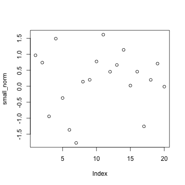 

So what did that do? Something you almost never want to bother doing: `R` plotted the data values in `small_norm` on the y-axis, with just the position of each value in the vector along the x-axis. Since the order doesn't mean anything, this is probably not the kind of plot we really wanted to produce. But for now, let's stick with it, just to illustrate some of the things you can do to customize plots.

### Labels
The first thing is to get the axis labels to be something reasonable. If we were just playing in `R`, we might be satisfied with the default label, which `R` takes from the name of the variable. But for any kind of publication (including homework!) you should change the axis labels to inform your readers about what the data represent. We do this with the `xlab` or `ylab` arguments, placing our label in quotes. We can also title the plot using `main`. (Some plots will have a default title. To get rid of it, you can use `main = ""` ).


plot(small_norm, 
     ylab = "My random variable",
     main = "A Bad Plot")


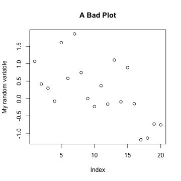 

We can also change what is being plotted (points, lines, etc.)using `type`, change the color of the points using `col`, and their shape with `pch` (which stands for "point character") and many other options. For a more extensive list, I recommend looking at the reference card available at: <http://cran.r-project.org/doc/contrib/Short-refcard.pdf>, and in particular the "Graphical parameters"" section. I'll use a few different options through this worksheet; see if you can figure out what is doing what by trying different settings yourself.


plot(small_norm, 
     ylab = "My random variable", 
     type = "l")


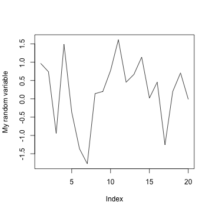 

`R` has a number of ways to define the color you want, but often the easiest is to just use one of the predefined colors, like `"blue"`, `"red"`, `"green"`, or `"lemonchiffon3"`. Yeah, the color names get strange. For a complete list of the colors, you can use the `colors()` command, or you could look at the following color chart: <http://research.stowers-institute.org/efg/R/Color/Chart/ColorChart.pdf> to see what they all look like. Note that color names have to be given  as strings with quotes around them (unless you store the color names in your own variable).


plot(med_norm, 
     ylab = "Another random variable",
     col = "firebrick", pch = 18)


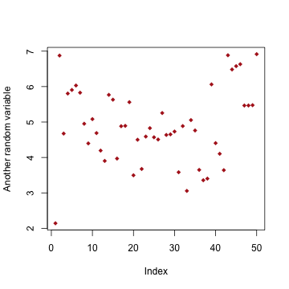 

To see the possible point types, you can make a quick plot using a command like the one below. 


plot(1:20, 
     ylab = "pch value", 
     pch = 1:20,
     col = c("red", "blue") )


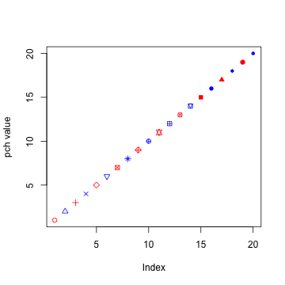 

Notice how I can give the `pch` and `col` arguments vectors, so each point gets a different shape and the colors alternate (because `R` is expanding the vector. You can do the same thing for any other option that affects the points, which can be useful for visually separating different subsets of data, or highlighting individual points. 

Create a plot of the `med_norm` vector where all the points greater than or equal to 5 are blue and all the points less than 5 are green. You will need to create a of color names to do this; the easiest way is to make a vector of all one color that the same length as the `med_norm` vector, using the `rep()` function, then replace the values that need to change using brackets (`[]`) to select them in a variable assignment statement.  
{: .question}

## Histograms
Since the previous plots were not particularly useful, lets try to do a bit better. We'll start with a basic histogram.


hist(med_norm)


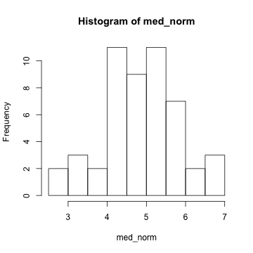 

We can adjust the number of divisions in the histogram with `breaks`. When making a histogram, this is probably your most important decision. If you have too many or too few breakpoints, your histogram will not be very informative. There are no hard and fast rules; it depends what you are trying to show with the plot, as well as how much data you have. (Note that `R` will not necessarily give the exact number of breakpoints that you ask for, it does some optimization internally. If you want, you can use `breaks` to specify the exact breakpoints with a vector instead of a single number. This can be useful for precise plots, and also for histograms with unequal bin widths.)


hist(small_norm, 
     breaks = 20, 
     col = "blue",
     main = "Too many breakpoints")


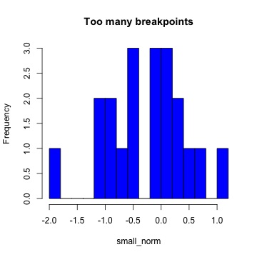 


hist(large_norm, 
     breaks = 20, 
     col = "blue",
     main = "Better with more data")


 

Create a histogram of the `large_norm` data with about 100 breakpoints. Is this a good number? Play around with different numbers of breakpoints until you find one that you think is a good representation of the data, showing a good level of detail, but not breaking things up too much.
{: .question}

## Bar charts
To make a bar chart in R, you can use the function `barplot()`. In the simplest case, you have a vector of numbers and a vector of labels. For example, if I were plotting the number of points scored by each team in the NFL Conference championships this year, I would have the following vectors:


teams <- c("49ers", "Falcons", "Patriots", "Ravens")
points <- c(28, 24, 13, 28 )
team_colors <- c("gold", "red", "blue", "purple")


The first argument of `barplot()` is the height of the bar, and `names.arg` (or just `names`) specifies the labels for each bar. Just like before, we can set the color for each bar with `col` and include nice labels for the axes.

 


barplot(points, names = teams, 
        col = team_colors, 
        ylab = "Points Scored", 
        xlab = "Team")


 

One thing you might have noticed is that the y-axis in this plot does not extend to cover all of the data. `R` has a tendency to do this in its attempts to find "pretty" (their word, not mine) places to put the axis ticks, but you might disagree with its decision about how long a given axis should be. Luckily, you can control this using `xlim` and `ylim`, each of which takes a vector of length 2 with the minimum and maximum values for the axis.


barplot(points, names = teams, 
        col = team_colors, 
        ylim = c(0, 30),
        ylab = "Points Scored", 
        xlab = "Team")


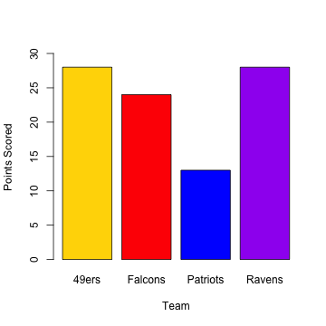 

As the data get more complicated, you might want to start grouping bars (for example to put the teams that actually played each other close together, with larger spaces between matchup pairs), but we will leave that for another time. It can get a bit unwieldy using the base graphics, and we can make much nicer looking plots using a package called `ggplot2`, which we will get to a bit later. 

## Box Plots
Another way we can represent a distribution is with a box plot, which we can make using the function `boxplot()`, of all things. For one variable, the call is simple:


boxplot(Petal.Length, ylab = "Petal Length (cm)")


 

The real utility of box plots though, is to compare distributions in a single plot. To include more than one variable, we need to enclose the variables in a `list`, which is a data structure we have not yet talked about. It is similar to a vector, but can contain elements of different types, including vectors. We could save the list to a variable name of its own, but for now we will just call `list()` within the `boxplot()` function. If To customise the labels for each box, you  use `names`, as in the `barplot()` example.


boxplot(list(Petal.Length, Petal.Width, Sepal.Length, Sepal.Width), 
        names = c("Petal Length", "Petal Width", 
                  "Sepal Length", "Sepal Width"),
        ylab = "centimeters")


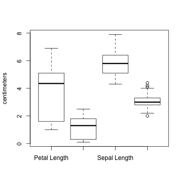 

Another thing we might want to do is to take the iris data and separate out the different species. To do that with base graphics, we have to introduce R formulas. A formula is a way of representing a relationship you want to explore. Take the classic linear relationship: $y=mx+b$. The variables are $y$ and $x$, with $m$ and $b$ as the constants of the relationship. Since in statistical analysis we generally don't know $m$ and $b$, the R formula expression just leaves them out, and we would represent the relationship between a response variable `y` and an explanatory variable `x` with the formula `y ~ x`. What that is saying is that `y` may depend on `x`, and that is the relationship I want to explore. In the context of the box plot, I want to see if the distributions are different for different species, so I will use the formula `Petal.Length ~ Species`. This is put in as the first argument. 


boxplot(Petal.Length ~ Species, 
        col = c("orange", "purple", "blue"),
        ylab = "Sepal Length (cm)")


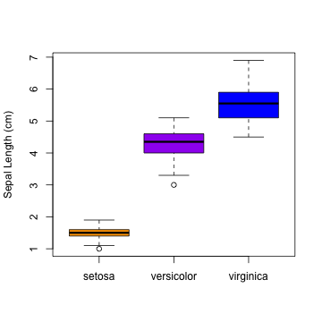 

You should be able to see pretty clearly why plotting all of the species together as we did earlie was a bad idea. The next set of exercises will start to do more with manipulating data, working with data frames rather than one vector at a time. This will allow us to more easily select subsets of data for calculations or plotting. For now, I will just leave you with an illustration of the kinds of plots that we will be able to make using data frames like this and the `ggplot2` package. The syntax is a bit different from the base graphics system, but allows us to do things like trend lines and multiple related plots ("facets" in the `ggplot2` vocabulary)  much more easily. Note that this code will only work on your system if you have installed `ggplot2`


require(ggplot2)

qplot(x = Species, y = Sepal.Length,
      data = iris,
      geom = "boxplot",
      fill = Species,
      ylab = "Sepal Lengh (cm)")


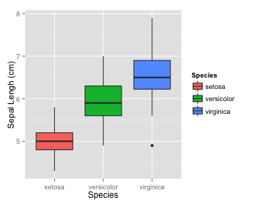 



qplot(x = Sepal.Width,
      data = iris,
      geom = "histogram",
      binwidth = 0.2,
      fill = Species,
      facets = Species~.,
      xlab = "Sepal Width (cm)")


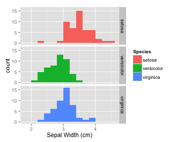 



qplot(x = Sepal.Width,
      data = iris,
      geom = "density",
      color = Species,
      fill = Species,
      alpha = I(0.3),
      xlab = "Sepal Width (cm)")


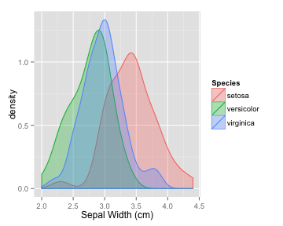 



qplot(x = Petal.Length, y = Petal.Width, 
      data = iris, 
      color = Species,
      shape = Species,
      geom = c("point", "smooth"),
      method = "lm",
      xlab = "Petal Length (cm)",
      ylab = "Petal Width (cm)")


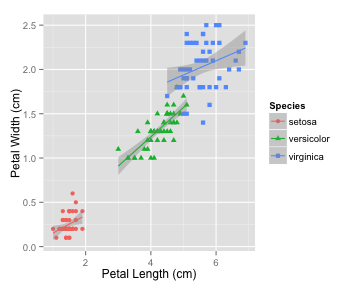 

