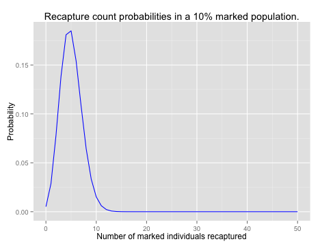
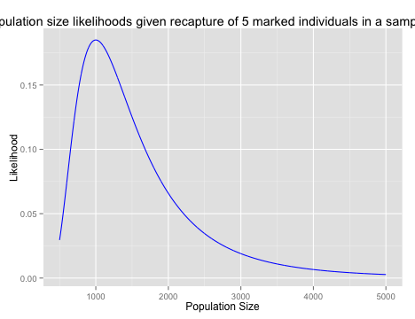

## Introduction
Estimating the number of organisms in a region is easiest if the organisms don't move and are easy to find. In that case, you can either count them all, or randomly choose subregions to sample and  count the number of individuals in each of those, multplying by the number of possible subregions. In that case, you would also be able to estimate a confidence interval based on the sampling error in your counts. If you are dealing with moving organisms, but ones that are easy to see, you can often do something similar: counting the number you see in a given area, possibly over time.

When the organims are cryptic, mobile, or hard to find, you might only be able to find them by trapping them, and you might not have a good sense of how much of the region you had sampled, or what fraction of individuals in an area you were able to catch. In short, a single sample might have any number of relations to the total number of individuals in the population, ($N$).  In this case, you can employ the capture-recapture method. In your first trip, you capture some number of individuals, which we will call $M$ (for marked). These are then marked somehow (with paint, legbands, clipping, or some other permanent mark) and returned to the region. After some time, you return and capture a second sample of individuals, $C$ (for capture), of which $R$ (for recapture) have the marks that you put on during the first trip. Assuming that no tags fell off, and no individuals left or entered the region (including by birth or death), then the fraction of individuals with marks in the second trapping should be equal to the fraction of the total population that you caught on the first trip. In other words:
$$\frac{M}{N} = \frac{R}{C}$$
therefore:
$$N=\frac{MC}{R}$$
 

### Functions in R
Since this is something we will be doing over and over, it is a good time to write our first function in `R`. Functions are one of the real strengths of `R`, since they allow you to run the same set of analysis repeatedly with different sets of input data, without having to copy and paste large chunks of code, and without cluttering up your workspace with all of the intermediate results. To define a function, you use the `function()` command, which takes as its arguments the names of the arguments that you your function will take. The commands that make up the function are then put in curly braces, `{}`, and can use the arguments you just defined as variables. To be more clear, here is an example of a function, one returns the 5% and 95% quantiles of a vector:


quant5to95 <- function(data){quantile(x = data, probs=c(0.05, 0.95))}
quant5to95(data = rnorm(10000))



##     5%    95% 
## -1.629  1.631


A slightly more complicated function might give the quantiles bounding a range. So If I asked for the 90% range it would five the 5% and 95% confidence intervals, or if I asked for the 50% range it would give the 25% to 75% range. This version also shows how you can specify a default value for an argument (the value if that argument is left blank), and a quick error check to stop the function if an invalid input is given. The error check uses an `if(){}` statement, which executes the code between the curly braces only when the statement in parenthesis is true; in this case it checks whether the range is nonsensical, in which case it stops the function and prints an error message using the `stop()` function. it also uses a proper return statement to specify the way the results are presented when the function is run. In this case, it will return a list with the  requested range as the first element (named `range`) and the calculated quantiles as the second named `bounds`.


quantRange <- function(data, range = 0.95){
  if (range > 1 | range <= 0){
    stop("range must be greater than 0 and less than 1.")
  }
  q_range <- c(0.5 - range/2, 0.5 + range/2)
  quants <- quantile(data, probs = q_range)
  return(list(range = range, bounds = quants))
}
a <- rnorm(10000)
quantRange(a, range = 0.5)



## $range
## [1] 0.5
## 
## $bounds
##     25%     75% 
## -0.6692  0.6630



quantRange(a)



## $range
## [1] 0.95
## 
## $bounds
##   2.5%  97.5% 
## -1.954  1.962


## Calculating Population Size
Now we should have everything we need to write some functions to calculate the number of individuals in a population based on the the number of individuals we caught in the two trappings and the number that were marked in the second trapping.


recapturePopSize <- function(first, second, marked){
  N_est <- first * second / marked
  return(N_est)
}


Now let's see how it well it works. Lets assume that the true population size is 5000 individuals. On the first trip we capture 100. When we rerelease them, then we have a total population of 100 marked individuals and 4900 unmarked individuals. On our second trip we will capture 200 individuals (we have gotten better at our trapping with practice!). We will simulate the number of individuals we capture who are marked by first creating a vector of individuals with 100 marked and 4900 unmarked, then using the `sample()` function to select 200 individuals from that population at random.


marked_pop <- factor(rep(c("marked", "unmarked"), c(100, 4900)))
trapped <- sample(marked_pop, 200)
n_marked  <-  sum(trapped == "marked")
n_marked



## [1] 4



recapturePopSize(100, 200, n_marked)



## [1] 5000


Doing this one time doesn't tell us much about the distribution of our estimate, so we will write a function to do the simulation, with arguments that specify the total population size and the number of individuals captured in the first and second trappings. If we made a `marked_pop` vector every time, this would be pretty slow to calculate, so we can take advantage of a function built into `R` that can do the same thing much more quickly. The second capture is very much like binomial sampling in that we are sampling individuals of two kinds from a population, but unlike binomial sampling, we are capturing individuals *without* replacement. This makes it into something called a hypergeometric distribution, which has the following probability function:
$$\Pr(R) = \frac{\binom{M}{R}\binom{N-M}{C-R}}{\binom{N}{C}}$$
To draw randomly from this distribution in `R`, we use the `rhyper()` function (`r` for random, `hyper` for hypergeometric). This takes four arguments:  
`nn` - the number of times we want to draw from the distribution (the number of trials or simulations)  
`m` - the number of marked individuals ($M$ in the equation above)  
`n` - the number of unmarked individuals ($N-M$ in the equation above)  
`k` - the number of individuals to choose for each sample ($C$ above)  

To create a single sample with this function, equivalent to the functions above, we would do the following:


n_marked <- rhyper(nn = 1, m = 100, n = 4900, k = 200)
n_marked



## [1] 4



recapturePopSize(100, 200, n_marked)



## [1] 5000


We can wrap this whole thing up in a function to calculate a single simulation, just returning the estimate we would have gotten given a population size, and our first and second capture numbers, then use the `replicate()` function in `R` to run it many times (10 in this case).


simRecapture <- function(N, first, second){
  marked <- rhyper(nn = 1, m = first, n = N - first, k = second)
  N_est <- recapturePopSize(first, second, marked)
  return(N_est)
}
sims <- replicate(10, simRecapture(5000, 100, 200))


In fact, this is still a slightly inefficient way to do things. That `nn = 1` argument to `rhyper()`, which told it we only wanted to do one trial, but the function would have been perfectly happy to do all of the trials we wanted all at once. You might think that you would still have to write a function to go through all of those results and apply our `recapturePopSize()` function, but in fact the function we wrote it will work just fine with vectors for each argument. So in this case, where we are not varying the number of individuals captured each trapping, we can do things a bit more efficiently without the separate `simRecapture()` function.


simRecapture2<- function(N, first, second, reps = 1){
  marked = rhyper(nn = reps, m = first, n = N - first, k = second)
  N_est <- recapturePopSize(first, second, marked)
  return(data.frame(first, second, 
                    marked, N_est))
}
simRecapture2(5000, 100, 200, reps = 5)



##   first second marked N_est
## 1   100    200      3  6667
## 2   100    200      9  2222
## 3   100    200      4  5000
## 4   100    200      8  2500
## 5   100    200      4  5000


## A Better Estimate
It turns out that this simple estimate of the population size is somewhat biased. This is perhaps easiest to see if you think about the case when you don't capture any marked individuals. Then $R = 0$, and the population is estimated to be of infinite size, which is never a good thing. A somewhat better estimator is the **Schnabel** method: 
$$\hat{N} = \frac{(M+1)(C+1)}{R+1} - 1 $$

Write a function to estimate the number of individuals in the population using the Schnabel method.  
**a.**  Using a population size of 4,000 individuals, simulate 1000 experiments where you capture 100 individuals in the first trapping and 100 in the second. Be sure to store the data from these (and the following) simulations, as you will need to use them for later problems as well. Generate a histogram of the estimated population sizes that you calculated.  
**b.**  How do your results change if you captured 500 individuals in the first trapping? What about if you caught 500 in the second (and 100 in the first)? It may be helpful to make histograms with fairly small bin sizes.  
**c.**  For each of the three experimental designs above, calculate the mean squared error of your estimate (using the true population size). Which gave the best estimate of the actual population size? Do you think it is better to put more effort into your first or second sample (assuming you can only put extra effort into one)?  
**d.**  Capture-recapture experitments assume that an individual's chance of being caught does not depend on whether it was marked or not. How would your results be affected if marking animals made them more likely to be caught by predators? What if marking individuals has no effect, but some individuals are more attracted to the bait you use than others?}
{: .question}

## Estimating Error
You calculated the true error in the calculation above, but of course you do not know the true population size most of the time, so this is not something that is possible to calculate. Instead you have to calculate some form of confidence interval or credible interval. There are two ways to do this: Frequentist and Bayesian.

### Frequentist Confidence Interval
It is possible to calculate the standard deviation of the estimate of population size using frequentist statistics. We won't derive this equation, but it is a reasonable place to start:
$$\mathrm{SE}(N) = \sqrt{\frac{(M+1)(C+1)(M-R)(C-R)}{(R+1)(R+1)(R+2)}}$$

Using the standard approximation of the 95% confidence interval as $\overline{x} \pm 1.96 \cdot \mathrm{SE}(x)$ it is possible calculate the confidence intervals for the previous simulations.

Write a function to calculate the standard error from a capture-recapture experiment using the numbers of individuals captured in the first and second trappings and number of marked individuals in the second trapping.  
**a.** Calculate the standard errors and confidence intervals for the previous simulations. Generate histograms of the minimum and maximum for each confidence intervals from the first set of simulations (with 100 individuals captured each time).  
**b.** Do these confidence intervals make sense? Why or why not?  
**c.**  What fraction of the time does your confidence interval include the true size of the population? Does this agree with what you know about confidence intervals?  
**d.**  You want to survey the number of lizards on an island. You are given a permit that allows you to trap and mark lizards, but you are only allowed 500 lizard captures total between two trips to the island; if you capture an individual once on your first trip and again on your second, it would count as two captures. What is the best way to divide your allotted lizard captures between the two trips? What quantity would you want to minimize?  
{: .question}

## Bayesian Analysis
To calculate Bayesian Credible Intervals, we will use, as you might have guessed, Bayes' Theorem. Stated for this context, it is:
$$\Pr(N=x|R) = \frac{\Pr(R|N=x)\Pr(N=x)}{\Pr(R)}$$ 
or in words:

The probability that the total population size ($N$) is $x$ given that we observed $R$ marked (recaptured) individuals in our second trapping is equal to the probability that we would capture $R$ marked individuals given that the population size is $x$ times the prior probability that the population size is $x$, divided by the probability that we would capture $R$ marked individuals, across all possible population sizes. (All given that we captured $M$ individuals in the first trapping and $C$ in the second)

So what parts of this do know from our data? Well, we know $R$, and if we assume that our sampling was random[^random], then we can calculate $\Pr(R|N=x)$ (the likelihood of $R$ given $N=x$) fairly easily for any value of $x$. It is the probability of getting $R$ 'successes' in $C$ trials where the probability of success is $M/x$, which you might recognize as the assumptions of the binomial probability distribution. Therefore:
$$\Pr(R|N=x) = \binom{C}{R}\left(\frac{M}{x}\right)^R \left(1-\frac{M}{x}\right)^{C-R}$$

Leaving aside the prior, $\Pr(N=x)$, for a moment, we will go on to $\Pr(R)$. By the law of total probability, we can calculate that:
$$\Pr(R) = \sum_x{\Pr(R|N=x)\Pr(N=x)}$$
which is to say that the total probability of the observed $R$ is equal to the sums of the probabilities of observing $R$ for each possible value of $N$ times the probability of that value of $N$.

[^random]: And that the population size was large and/or we caught individuals one at a time and released them, allowing us to use the binomial approximation.

So that leaves us again with $\Pr(N=x)$, which is the prior probability that $N$ equals some value $x$. Here there are a number of options, as you might have any number of ideas about what the population size is most likely to be. For now, we'll just assume that the population size is less than some large number, say 100,000 individuals. We can also be pretty safe in assuming that it is larger than the maximum of $M$ and $C$, since we did capture that many individuals. Other than that, we won't assume anything, and we will set the prior probability of $x$ as $1/(100,000 - {\rm max}(M,C) + 1)$

## Calculating likelihoods
So with the math sorted out, we can start to code it into `R`. First, the likelihood of the data, $\Pr(R|N=x)$, we can calculate using the `dbinom()` function. This takes the same `size` and `prob` arguments as rbinom, but returns the value of the binomial probability distribution at some value or values. So if we want to know the probability of catching 5 marked individuals among 50 trapped individuals if the population size was 1000 and we had trapped 100 individuals on the first trip, that would look like this:


dbinom(5, size = 50, prob = 100/1000)



## [1] 0.1849


In fact, we could calculate it for a range of numbers of marked individuals, using the fact that `R` loves to work with vectors. We could go ahead and calculate the entire probability  distribution; the chance of catching 0, 1, 2, ... , 50 marked individuals in a sample of 50, which I have plotted for your edification. What you may not be able to see exactly, but should be aware of, is that the sum of these probabilities is equal to 1. Check this for yourself using `sum()`.


#full probability distribution
recaptured <- 0:50
probs <- dbinom(recaptured, size = 50, prob = 100/1000)

library(ggplot2) #load ggplot2
qplot(x = recaptured, y = probs,
      color = I("blue"), 
      geom = "line",
      main = "Recapture count probabilities in a 10% marked population.",
      xlab = "Number of marked individuals recaptured", 
      ylab = "Probability")


 

Of course, for a given experiment, we only see one outcome; we capture one group of animals and see one number of marked individuals among them. What we want to know is what the chance is that we would have seen that number of marked individuals given some range of population sizes. Again, this is the *likelihood* of the data given a particular parameter value. `R` is happy enough to calculate `dbinom()` for a variety of population sizes as well, and we can generate a plot of the likelihood of observing 5 marked individuals given a variety of total population sizes. 


popsize <- 500:5000
likes <- dbinom(5, size = 50, prob = 100/popsize )
qplot(x = popsize, y =  likes,
      color = I("blue"), 
      geom = "line",
      main = "Population size likelihoods given recapture of 5 marked individuals in a sample of 50.",
      xlab = "Population Size", 
      ylab = "Likelihood")


 

The likelihood of the data across a range of parameters is often used directly to estimate the true value of a paprameter. To do this, you find the *maximum likelihood*, the value of the parameter that results in the largest likelihood value under your model. Calculate the likelihood values for population sizes between 200 and 100,000 individuals, for a project where you trapped 200 birds on your first trip to an island, banded and released them, then  returned to caputure 200 birds on your second visit, of which 24 were marked. For your own reference, generate a plot of the population sizes and the corresponding likelihoods.  
**a.**  What is the maximum likelihood, and what population size does it correspond to? You will find the functions `max()` and  `which.max()`, which is also discussed below, to be quite helpful.  
**b.**  How does the maximum likelihood value you calculate compare to our naive estimate of the population size from teh first part. What about the Schnabel estimate? Do you think the maximum likelihood is an unbiased estimator of the population size?  
**c.**  Do the values of the likelihood distribution sum to 1? Why or why not? (An intuitive explanation is fine.)  
**d.**  A common way of estimating a confidence interval on a maximum likelihood calculation is to find the range of values such that  $\log({\rm Max}({\rm Likelihood}(\theta))/{\rm Likelihood}(\theta = x)) \le 1.92$. Based on this method, what confidence interval would you calculate for the population size? Does this method seem better or worse than the simple calculation presented earlier?  
{: .question}

### Calculating posterior probability
With the likelihood calculations done, we should be able to construct a function to calculate the posterior probability distribution of population size given the number of marked individuals that we caught on our second trapping trip. First a function to make the vector of population sizes we will look at (with a minimum as described above), and their prior probabilities.


makePrior <- function(max_N, first=1, second=1){
  #impossible to have a population size smaller than the number captured in either run
  N <- max(c(first, second)):max_N
  prob <- 1/length(N)
  return(data.frame(N, prob))
}


Since we can caluculate the all of the likelihoods we need as described above, we can go right on to calculating the posterior probabilities of each population size given the number of marked individuals, the number of individuals trapped each time, and the prior probabilities (with the prior given as a a data frame with columns named `N` and `prob`, as constructed above). 


calcPosterior <- function(marked, first, second, prior){
  likelihoods <- dbinom(marked, size = second, 
                        prob = first/prior$N)
  numerators <- likelihoods * prior$prob
  denominator <- sum(numerators)
  posterior <- numerators/denominator
  return(data.frame(N = prior$N, prob = posterior))
}


Nowe we can construct a prior and calculate the posteriors, using the count data from our hypothetical experiment.


prior <- makePrior(10000,100, 100)
posterior <- calcPosterior(marked = 5, 100, 100, prN_prior)

# reformat data for plotting ease:
# combine prior and posterior into a single data frame, 
# with an extra column to identify the two distributions.
plotdata <- rbind( cbind(prior, dist = "Prior"),
                   cbind(posterior, dist = "Posterior") )

qplot(data = plotdata,
      x = N, y = prob, 
      color = dist,
      geom = "line", 
      xlab = "Population Size", 
      ylab = "Probability") +
  guides(color = guide_legend(title = "Distribution"))


 

One thing we might want to know from this is what the most probable value is for the population size. One way to do this is to use the function `which.max()` to get the index of the largest of the probability values from the posterior distribution, selecting the whole row from data frame.


posterior[which.max(posterior$post_prob), ]



## [1] N    prob
## <0 rows> (or 0-length row.names)


### Calculating credible intervals
This should give similar answers to the previous (frequentist) way of estimating the population size, but it is not necessarily unbiased in the same way, since it depends not just on the data but also the prior probability that we arbitrarily (but with some justification) assigned to the population size. More importantly, we can now calculate a Bayesian credible interval, the interval of the probability distribution that contains a given fraction (95%, for example) of the total probability. The easiest way to do this is to calculate the cumulative sums of the posterior probabilities, using the function @cumsum()@, then find the population size values that corespond to the ends of the interval we want. For example, if we wanted the 95% credible interval, we would be looking for where the cumulative probability crossed 0.025 and 0.975. Below is a function to do this, and also return the site with the maximum probability, and the midpoint of the probability distribution, where there is an approximately equal probability that the true population size is above or below that value.


credIntN <- function(prN, range = 0.95){
  #get the max first
  max_prob <- prN$N[which.max(prN$prob)]
  #calculate the ends of the interval
  pmin <- 0.5 - range / 2
  pmax <- 0.5 + range / 2
  #make the cdf and find bounds
  cum_prob <- cumsum(prN$prob)
  low_tail <- cum_prob <= pmin
  low_bound <- max(prN$N[low_tail])
  high_tail <- cum_prob >= pmax
  high_bound <- min(prN$N[high_tail])
  mid_prob <- min(prN$N[cum_prob >= 0.5])
  
  return (data.frame(max_p = max_prob, mid_p = mid_prob,
                    bayes_lower = low_bound, bayes_upper = high_bound))
}


Finally, with all of that we can make a nice tidy function that takes a set of values for the number of individuals caught in the first trapping (and then marked and released), the number caught in the second trapping, the number of the second set that were marked, and the maximum population size we are willing to consider (with a default of 100,000). The function will then construct the prior, calculate the posterior, and return the results of our Bayesian analysis, optionally including the full posterior distribution).


bayesPopSize <- function(marked, first, second, 
                         max_N = 10^5,  return_post= F){
  input_frame <- data.frame(marked, first, second)
  prior <- makePrior(max_N, first, second)
  posterior <- calcPosterior(marked, first, second, prior)
  intervals <- credIntN(posterior)
  if(return_post){
    return(list(posterior = posterior,
                summary = cbind(input_frame, intervals)))
  }else{
    return(cbind(input_frame, intervals))
  }
}

bayesPopSize(marked = 5, first = 100, second = 100)



##   marked first second max_p mid_p bayes_lower bayes_upper
## 1      5   100    100  2000  2705        1162        8995


Using the same conditions as the last problem, calculate the posterior probability, using a maximum possible population size of 100,000 individuals.  
**a.**  What is the most probable value, and what is the credible interval? How does it compare to the estimate based on the likelihood values?  
**b.**  Give an intuitive explanation of the differences between the maximum likelihood confidence interval and the Bayesian credible interval. (Don't just state the definitions of confidence interval and credible interval, but think about how they were calculated here.)  
**c.**  How do these values change if you had presupposed a maximum possible population size of 10,000? Explain this result. Is the maximum of 10,000 individuals a good choice for a prior?  
{: .question}

On your first trip to the island with the lizards, you had caught and marked 205 individuals. When you came back for the second trip, you caught 302, of which 25 were marked. Hoping to get another chance to visit the island, you mark all of the lizards that didn't already have marks and release them. Based on your results, the government lets the small violation of your permit slide, and grants you the opportunity to make a third trip. On this trip, you capture only 107 individuals, of which 8 are marked.  
**a.**  How many total individuals were marked when you went out to trap the third time? Assume no loss of markings.  
**b.**  Calculate population size estimates and Bayesian credible intervals using the data from the second and third trips, using a simple prior as your starting point.  
**c.**  Is this an appropriate prior distribution to use for the data from the third trip? What might be a better choice?  
**d.**  Use the alternative prior that you identified in the previous part to calculate a new posterior distribution for population size using the data from the third trip. Calculate an estimate of the population size and credible intervals based on this posterior distribution. How does this estimate compare to your previous calculations?  
**e.**  Plot the three posterior distributions (the two from part b and the one from part d) in a single chart. Which one provides the best information about the size of lizard population?
{: .question}
