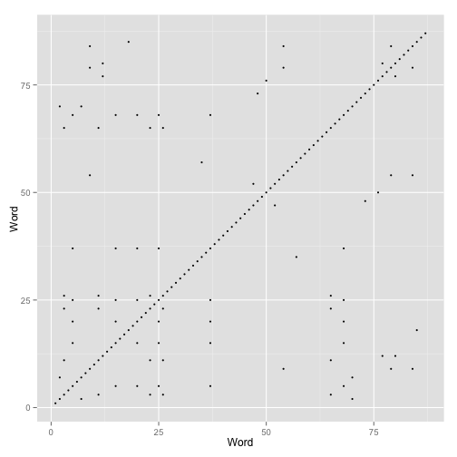
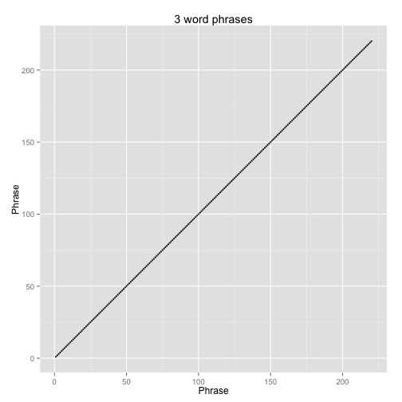
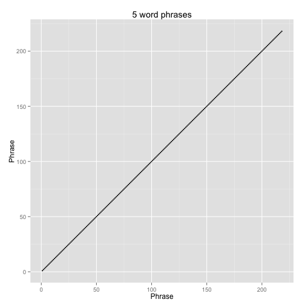
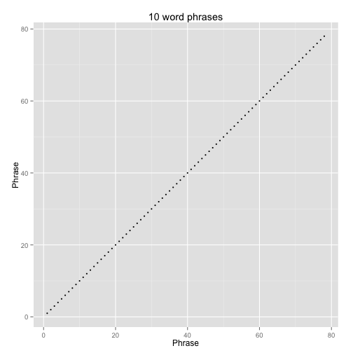
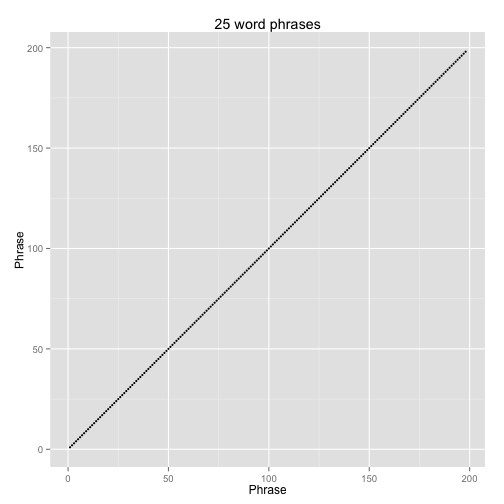

Seuss Assembly
========================================================

Lets try an experiment where we try to assemble Green Eggs and Ham by Dr. Seuss from sentence fragments. To make it a bit harder, we will start by removing all punctuation (except Sam-I-am) and making everything upper case. Then load in the Dr. Seuss text into an array of words called `seuss`. I'm hiding this in the output, but you can see it in the source code for this document.


Looking just at the start of the array:

```r
head(seuss)
```

```
## [1] "THUS,"   "FROM"    "THE"     "WAR"     "OF"      "NATURE,"
```

##Dot plot
Lets make a dot plot of Dr. Seuss. To do this we need a matrix of word positions and all the places that they are equal  to each other.

```r
library(reshape2)
library(ggplot2)
smatrix <- sapply(1:length(seuss), function(s) {
    seuss == seuss[s]
})
points <- melt(smatrix)
dots <- subset(points, value)
qplot(data = dots, x = Var1, y = Var2, xlab = "Word", ylab = "Word", size = I(1), 
    asp = 1)
```

 

That is a bit of a mess, so lets make it nicer and more informative by not using individual words, but phrases of some length. We'll write a function to do this, so we could do it for any text, and any phrase length. Then we'll plot the positions where phrase lengths of 3, 5, 10, and 25 words repeat.

```r
phraseDotPlot <- function(words, l) {
    phrases <- sapply(1:(length(words) - (l - 1)), function(p) {
        paste0(words[p:(p + l - 1)], collapse = " ")
    })
    phrase_matrix <- sapply(1:length(phrases), function(p) {
        phrases == phrases[p]
    })
    points <- melt(phrase_matrix)
    dots <- subset(points, value)
    qplot(data = dots, x = Var1, y = Var2, xlab = "Phrase", ylab = "Phrase", 
        size = I(1), asp = 1, main = sprintf("%d word phrases", l))
}

phraseDotPlot(seuss, 3)
```

 

```r
phraseDotPlot(seuss, 5)
```

 

```r
phraseDotPlot(seuss, 10)
```

 

```r
phraseDotPlot(seuss, 25)
```

 


Lets start with random 3 word phrases, but only from the first 133 words. So we can start with any position from 1:131, then take the next three words, concatenate them (with a space), and those will be our "reads". Lets start with 100 reads.


```r
l = 3
n = 100
starts <- sample(1:(133 - (l - 1)), size = n, replace = T)
fragments <- sapply(starts, function(s) {
    paste0(seuss[s:(s + l - 1)], collapse = " ")
})

head(fragments)
```

```
## [1] "SIMPLE A BEGINNING" "GRAVITY, FROM SO"   "ON ACCORDING TO"   
## [4] "AND DEATH, THE"     "NA NA NA"           "OF LIFE, WITH"
```


